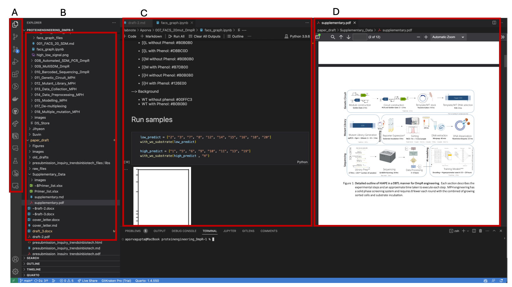
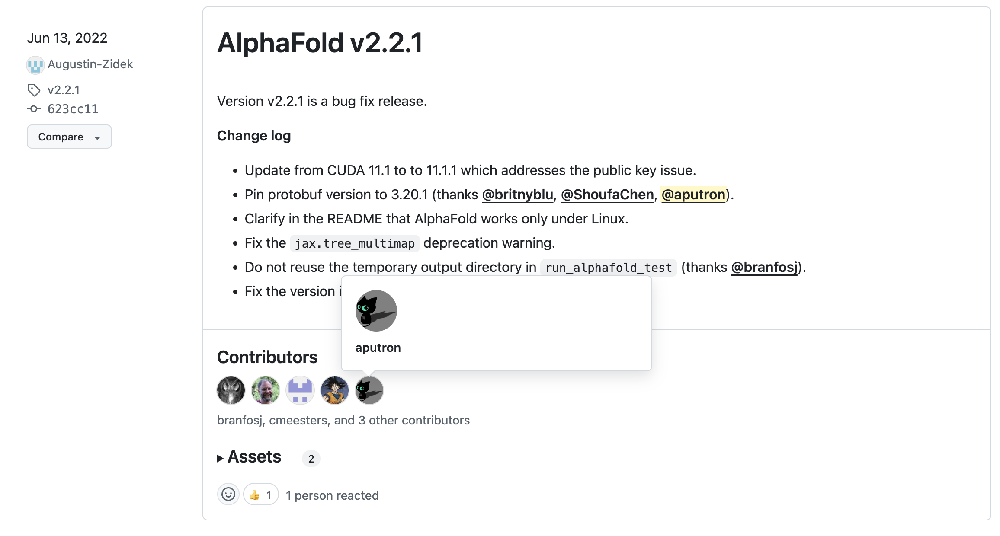
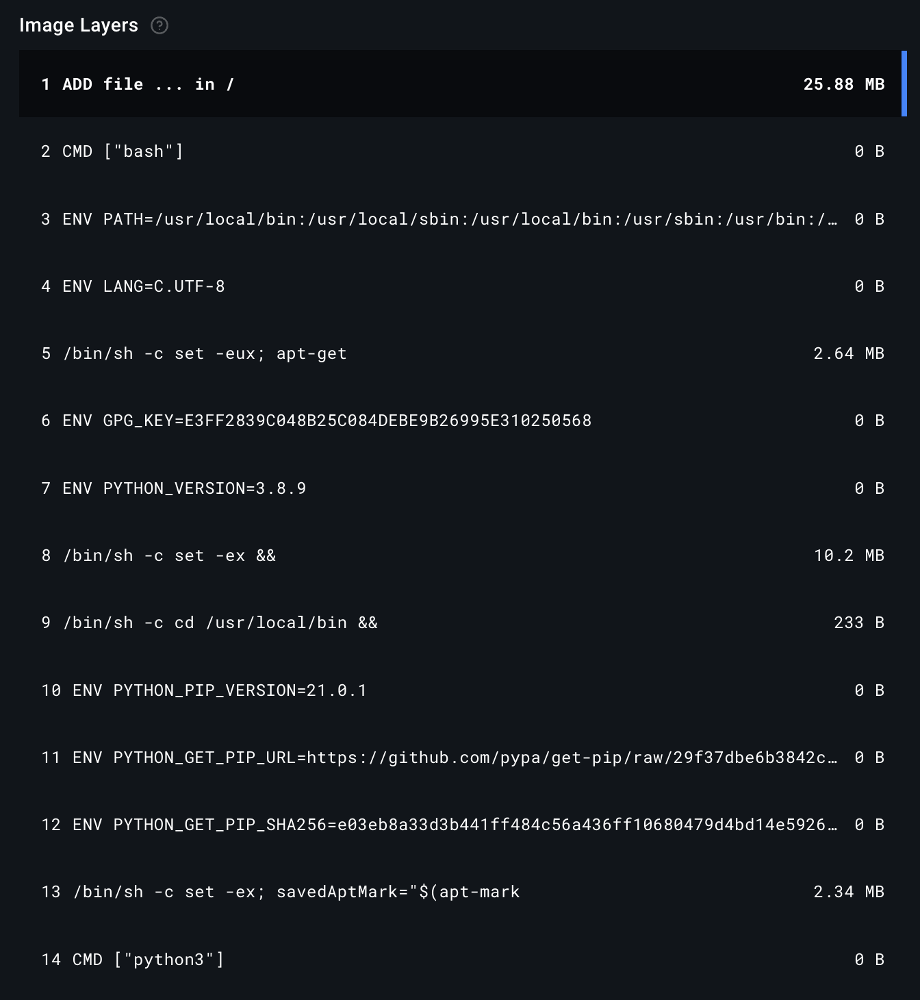

# Appendix {.unnumbered}

## Chapter 2

{#fig-VS_code}

{#fig-AF_git}

{#fig-dockerfile}

## Chapter 3

![A. DmpR detailed rounding for Signal (with 10\$\\mu\$M of phenol). Wild-type (WT) is shown in blue, mutant library (ML), low activity samples in yellow and high activity samples in green. Y-axis is the relative fluorescence as generated by the FCS file from FACS, and the X-axis is the frequency of cells. As WT can already recognize phenol well, we use 5% of WT as the threshold for determining the gates for high and low activity within the Mutant Library. Two rounds with the fixed gates are sufficient to separate the low and high activity populations.B. DmpR detailed rounding for Background (without substrate). Here, WT background is as much as the ML, 5% of the ML is directly used as gates. Subsequent roundings use 5% of the resulting populations to efficiently separate the samples.](images/DmpR_round.png){#fig-DmpR_round}

![**Simultaneous increase in second phenotype** **A**. DmpR Signal sorting final "high" samples as the background and signal fluorescence. While sorting for high signal, background also increases, suggesting most of the variants are active on default; it does not matter if phenol is present or not. **B.** DmpR Background sorting final "high" samples as background and signal fluorescence. While sorting for high background, signal also increases, without much fold change in the presence of phenol. **C**. MPH Signal sorting final "high" samples as background and signal fluorescence. Background is expected to remain equal to WT as DmpRCK is assumed to be constant and in the absence of substrate, DmpR does not have activator molecule. High background occurs due to presence of false positives, i.e. variants with mutations in the genetic circuit. These false positives need to be filtered out prior to training the model](images/Background.png){#fig-background}

{#fig-mph_filter}

![**MPH detailed rounding with 10**$\mu$**M EPN**. Wild-type (WT) is shown in blue, mutant library (ML), low activity samples in yellow and high activity samples in green. Y-axis is the relative fluorescence as generated by the FCS file from FACS, and the X-axis is the frequency of cells. Here, WT background is as much as the ML, 1% of the ML is directly used as gates. Subsequent roundings use 1% of the resulting populations to efficiently separate the samples. To reduce false positives (Supplementary Figure 4), a round without substrate where sorting for the middle 40% of the population can be added.](images/MPH_round.png){#fig-mph_round}

![Nanopore improvement with new kit chemistry A. (Left) Reads generated by the former Nanopore R9 chemistry. In blue are the total reads, in green are the reads that have passed (read quality score \>10) and in read are those that have failed (read quality score \<10). The number of failed reads are almost of the same amount as the passed reads. The number of reads are in the order of 105. (Right-Top) The same run represented in terms of the quality of reads. The overall quality of reads is poor (Q-score\<15). (Right-Bottom) Passed and filtered DmpR reads visualized in IGV desktop application. Each gray row represents the mapped read, where each gap represents deletion in the read and the purple lines represent an insertion. This version contributes to many "sequencing errors" of insertions and deletions. B. (Left) Reads generated by the new Nanopore R10 chemistry. 80% of the reads have passed (read quality score \> 10). The number of reads are in the order of 106. (Right-Top) The same run represented in terms of the quality of reads. The overall quality of reads is improved (Q-score \>20). (Right-Bottom) Passed and filtered DmpR reads visualized in IGV desktop application. Fewer noticeable "errors" than A.](images/nanopore_kit.png){#fig-nanopore}