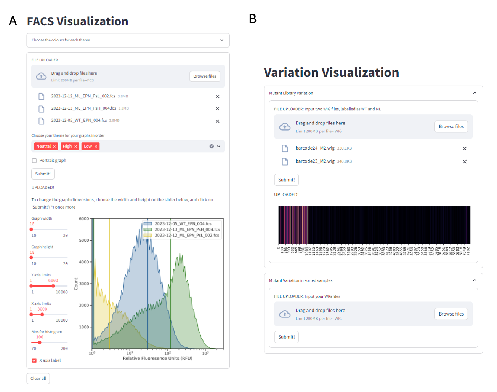

# Computational Tools for Streamlined Biofoundry Workflows

## Introduction

Various molecular experiments have been significantly streamlined with the advent of machines that can replace arduous laboratory work. For example, even simple gel electrophoresis experiments can be left to E-gel Electrophoresis systems (Invitrogen, ThermoFisher) for a small number of samples or fragment analyzers (Agilent) when working at scale. By leveraging such advanced technologies, researchers can focus on data interpretation and experimental design.

In a biofoundry, it is typical to find such machines, each playing a specialized role in the overall experimental strategy[@myers2017standard]. However, when dealing with a diverse array of equipment from various manufacturers, it is common to encounter a range of challenges. These devices often require different inputs, feature distinct user interfaces (UIs) that each come with their own learning curves, utilize various file formats, and may have incompatible data structures [@torres2022automated]. Such discrepancies can significantly reduce the efficiency of workflows by requiring constant supervision and hinder the overall productivity of research efforts. An example of these costs can be illustrated by Amyris' artemisinin project. This five-year, \$20 million initiative reportedly dedicates 95% of its time to identifying and addressing unintended interactions between various components [@henkel2007economics].

To address these challenges, the field of bio-design automation (BDA) was conceptualized. Modeled after electronic-design automation (EDA), which revolutionized the electronic industry by creating software tools for designing and managing complex electronic systems, BDA aims to enhance the efficiency and scalability of biological research and engineering [@appleton2017design]. This field fosters an interdisciplinary community that brings together biologists, engineers, computer scientists, and data analysts, all collaborating to address specific challenges within synthetic biology workflows. By identifying and tackling subproblems, BDA encourages the development of specialized software tools that support the design, construction, and testing of biological systems[@appleton2017needs]. These tools not only streamline experimental processes but also facilitate the iterative refinement of biological constructs, ultimately enabling researchers to innovate more rapidly and effectively.

For a biofoundry that necessitates the development of diverse workflows tailored to multiple applications, the adoption of open-source software is critical. Recent efforts include, SynBiopython[@yeoh2021synbiopython] focuses on the standardize the file formats and tool interoperability, and BioNumpy[@rand2024bionumpy] allows for array programming of biological data. Open-source solutions by rapidly-prototyping software offer the advantage of seamless integration of various modules and expand the range of workflows.

This chapter, addresses the considerations for a biofoundry and the development of workflows, software and tools to streamline processes common in synthetic biology. Here the tools for data visualization, analysis, logging, sharing, modelling, machine operatability are exhibited. The chapter focuses on tools programmed using Python, with user interfaces developed on Streamlit, which provide a base for further chapters.

## Computational Tools:

### Tools for Data Logging and Collaboration:

{width="352"}

#### Electronic Lab Notebooks:

Electronic Lab Notebooks (ELNs) are essential tools in modern research environments, offering several key advantages over traditional paper notebooks. They facilitate efficient data management by allowing researchers to easily organize, store, and retrieve experimental data. ELNs enhance collaboration among team members by enabling real-time sharing and commenting on data, which fosters greater communication and collective insights. Moreover, they improve data integrity and reproducibility through built-in version control and automated backups, reducing the risk of data loss or errors. ELNs also streamline compliance with regulatory requirements by providing secure, auditable records of experiments. Additionally, their integration with other digital tools and platforms can enhance workflows and automate routine tasks, ultimately increasing productivity and accelerating the research process[@kwok2018, @eblen2015comparing].

While there are free options for ELN software, many vendors limit data storage, file sizes, and the number of users, which can hinder larger teams or projects. Portability of files can also be a concern depending upon the ELN provider; for example if it ceases operations or raises prices, users may only receive a PDF export of their data, complicating transitions to other platforms. Although infrequent, security breaches, are a potential risk that users should be aware of. Additionally, not all electronic solutions cater to every lab's needs; for example, some ELNs do not integrate with specific biotools like CRISPR/Cas9 genome editing software. Furthermore, user experience can vary significantly; many reviews point out issues with nonintuitive interfaces and the need for extensive training, which can slow down effective implementation in the lab [@Schmerker_2020].

Here, we describe using Visual Studio (VS) Code along with quarto markdown files as an ELN. VS Code is compatible with most types of files. VS Code allows for the creation of Markdown files, which can be used to document experiments, protocols, and results in a structured and easily readable format (Appendix: @fig-VS_code). The built-in version control system (Git) enables users to track changes over time, making it simple to maintain a history of experiments and revisions. Open-sourced extensions allow integration of other software such as Docker, GitHub, and Notion which can be standardized through a free account.

Moreover, integration of Jupyter Notebooks allow for interactive data analysis and visualization, integrating coding directly with documentation. This can be particularly useful for analyzing data using programming languages such as Python or R. Users can also benefit from VS Code's robust search capabilities, making it easy to locate specific notes or data points across multiple files. Overall, using VS Code as an ELN combines flexibility, organization, and collaboration, making it a compelling choice for researchers looking to streamline their documentation processes.

#### Version Control:

Collaboration is streamlined on GitHub, as multiple team members can work on the same project simultaneously. Additionally, the ability to store files in cloud-based repositories (like GitHub or GitLab) ensures data portability and accessibility, even if the original workspace changes. This allows users to track changes over time, providing a clear history of modifications, which is essential for reproducibility and accountability. Users can create branches to explore new ideas or experiment with changes without affecting the main content. Pull requests enable thorough discussions and reviews of proposed changes before merging, ensuring that all contributions are vetted and enhancing the quality of the documentation (Appendix: @fig-AF_git).

GitHub also supports Markdown, making it easy to format notes for clarity and readability. With features like issue tracking, users can manage tasks and monitor project progress efficiently. The platform’s cloud-based storage ensures that data is accessible from anywhere, minimizing the risk of loss. Overall, using GitHub for version control in an ELN not only improves organization and collaboration but also enhances the integrity and transparency of the research process.

Using Docker to share workflow environments offers a powerful solution for ensuring consistency and reproducibility in research and development projects. Docker allows users to create containerized environments that encapsulate all necessary dependencies, libraries, and configurations required to run a specific application or workflow. This means that researchers can share their entire computational environment, ensuring that collaborators can run the same code with the same results, regardless of their local setups (Appendix: @fig-dockerfile).

By creating a Docker image, users can package their workflows along with any required software, making it easy to distribute and deploy on any system that supports Docker. This eliminates the common "it works on my machine" problem, as the container will behave the same way on any platform. Additionally, Docker supports versioning, allowing teams to track changes in their environment over time and roll back to previous configurations if needed. [@eyersgithub], [@leahy2022]

Models and datasets can be uploaded on AI sharing platforms such as Huggingface.

### Design Tools:

When managing a large number of samples, the design of DNA fragments can become a complex and cumbersome process. This challenge is exacerbated by the need to ensure specificity and efficiency in fragment design, which is crucial for downstream applications such as cloning, sequencing, or synthetic biology. As sample numbers increase, the potential for human error also rises, leading to inconsistencies that can compromise experimental outcomes. Moreover, the iterative nature of fragment design often necessitates multiple rounds of optimization, further extending the time and resources required for successful implementation. Consequently, the integration of automated design tools and software that can handle bulk DNA fragment design may prove invaluable. Such tools can streamline the process, enhance accuracy, and significantly reduce the workload associated with designing DNA fragments across numerous samples, thereby improving overall productivity in molecular biology workflows.

{#fig-design}

#### *In-silico* Mutant Generator:

Optimizing DNA fragments in synthetic biology is a crucial step in the development of efficient and functional biological systems, necessitating the creation of a diverse array of mutant candidates to explore variations that can enhance performance. The traditional approaches to generating these mutants are often labor-intensive and resource-consuming, posing significant challenges in terms of time and scalability. In response to these limitations, we have developed an innovative *in-silico* mutant library generator that harnesses computational power to simulate a broad spectrum of mutations across selected DNA sequences. This generator creates a library of a predefined size introduces various types of point mutations in each mutant. By integrating it with machine learning approaches trained on extensive datasets, this tool can be used to identify appropriate optimized candidates.

```         
# Pseudocode for in-silico mutant generator

INPUT: Target DNA Sequence (FASTA file / string) 
OUPUT: Mutant Library (FASTA file)

FUNCTION GenerateMutantLibrary(originalSequence, mutLibSize, numMutants):
    mutantLibrary = []  # List to store mutants

    FOR x FROM 1 to mutLibSize:
        FOR i FROM 1 TO numMutants:
            # Start with the original sequence
            mutantSequence = originalSequence  

            # Mutate a random sequence with random base
            position = RandomPosition(originalSequence.length)
            newBase = RandomBase(exclude=originalSequence[position])
            mutantSequence[position] = newBase
    
            # Store mutant DNA and AA sequences
            mutantLibrary.append((DNAmutantSequence, AAmutantSequence))

    RETURN mutantLibrary
```

A simple user interface (UI) for the algorithm (@fig-design: A) is available at <https://insilicomutantlib.streamlit.app/>

#### Primer design:

Site-directed mutagenesis (SDM) is a technique used to introduce specific nucleotide changes into a DNA sequence, allowing researchers to study gene function, protein interactions, and other biological processes. Automating the primer design process for SDM can significantly enhance efficiency and accuracy. The algorithm generates primers in a way that accommodates various assembly techniques, including Gibson assembly, staggered Gibson assembly, and ligation assembly, for site-directed mutagenesis (SDM). For Gibson assembly, the primers are designed to be completely overlapping regions with the target mutation at the middle, facilitating the seamless integration of DNA fragments in a single reaction. In the case of staggered Gibson assembly, the algorithm designs one primer with the mutated base, and the other primer has 10bp of a flanking region. For ligation assembly, the primers are crafted to produce compatible ends, ensuring effective joining of the mutated fragments using DNA ligase. The tool can generate primers for a large number of mutants, even those containing multiple mutations, using the output from the in-silico mutant library. This capability is particularly advantageous in high-throughput experimental settings where researchers aim to explore a diverse array of genetic modifications simultaneously.

The tool also designs primers for multiplexed barcode sequencing, a process elaborated upon in Chapter 4. Users can input their specific target sequences into the tool, which then generates complementary primers optimized for those sequences. A key feature of this tool is its ability to incorporate pre-defined barcodes into the primers, allowing for the simultaneous analysis of multiple samples in a single sequencing run.

First, the melting temperature (Tm) is carefully calculated and adjusted to promote efficient annealing to the target DNA. This optimization helps ensure that the primers will bind effectively under the chosen PCR conditions, thereby increasing the likelihood of successful amplification. Additionally, the GC content of each primer is tailored to fall within an ideal range, typically between 40% and 60%. This balance enhances the stability of the primer-template duplex, improving the fidelity of the resulting PCR product. Importantly, the design process avoids incorporating thymine at the 3' end of the primers, as this can lead to non-specific binding and reduced efficiency in the amplification process. All outputs are provided as a CSV file with primers organized by name in a 5' to 3' manner for easy order placement by a DNA synthesis company.\

```         

# Pseudocode for primer design for SDM

FUNCTION DesignPrimers(targetSequence, mutation, assemblyType):
    # Initialize empty lists for primers
    forwardPrimer = []
    reversePrimer = []

    # Determine mutation position
    mutationPosition = FindMutationPosition(targetSequence, mutation)

    # Generate forward primer with mutation
    IF assemblyType == "Gibson Assembly":
        forwardPrimer = [mutationPosition - 10:mutationPosition] + mutation + [mutationPosition:mutationPosition + 10]
        reversePrimer = reverseComplementaryDNA(forwardPrimer)
        forwardPrimer_final, reversePrimer_final = optimizePrimers(forwardPrimer, reversePrimer)
    
    ELSE IF assemblyType == "Staggered Gibson Assembly":
        forwardPrimer = [mutationPosition - 10:mutationPosition] + mutation + [mutationPosition:mutationPosition + 15]
        reversePrimer = reverseComplementaryDNA(mutationPosition:mutationPosition + 15)
        forwardPrimer_final, reversePrimer_final = optimizePrimers(forwardPrimer, reversePrimer)

    ELSE IF assemblyType == "Ligation Assembly":
        forwardPrimer = [mutationPosition - 10:mutationPosition] + mutation + [mutationPosition:mutationPosition + 10]
        reversePrimer = reverseComplementaryDNA(mutationPosition + 10: mutationPosition + 30)
        forwardPrimer_final, reversePrimer_final = optimizePrimers(forwardPrimer, reversePrimer)

    RETURN (forwardPrimer_final, reversePrimer_final)


FUNCTION PrimersMutantLibrary(FASTAfile, mutations, assemblyType)   
    sequences = read(FASTAfile)
    primerList = []

    FOR sequence in sequences:
        FOR eachMutation in mutations:
            primers = DesignPrimers(sequence, eachMutation, assemblyType)
        primerList = [primers]

    RETURN (primerList)
    
```

```         

# Pseudocode for barcode primer design

FUNCTION BarcodePrimers(frontPrimer, reversePrimer, forwardBarcodeList, reverseBarcodeList):
    FOR barcode in forwardBarcodeList:
        barcodedForwardPrimer = frontPrimer + barcode
    forwardPrimerList = [barcodedForwardPrimer]

    FOR barcode in reverseBarcodeList:
        barcodedReversePrimer = reversePrimer + barcode
    reversePrimerList = [barcodedReversePrimer]

    forwardPrimer_final, reversePrimer_final = optimizePrimers(forwardPrimerList, reversePrimerList)

    RETURN (forwardPrimer_final, reversePrimer_final)
```

A simple user interface (UI) (@fig-design) for the algorithm is available at <https://mutprimergen.streamlit.app/>

### Machine Interoperability:

Most automated machines feature user interfaces designed to facilitate the mapping of wells for essential laboratory tasks such as aspirating, dispensing, and mixing liquids. These interfaces simplify the process by allowing users to visually select and configure the wells according to their experimental needs. Additionally, many of these systems can operate using CSV (Comma-Separated Values) files, which contain critical information, including Source Well, Destination Well, and Volume.

However it can be cumbersome to use the UI when working with large number of samples or continuously repeated protocols. When faced with such complex workflows, utilizing an automated script to map the samples in a CSV file can significantly enhance efficiency and accuracy. Workflows can be organized to work continuously in this manner. The script for the same is available on <https://github.com/aputron/streamlitapps/tree/main>

### Analysis Tools:

#### Nanopore Analysis:


Sequenced reads with unique barcodes are outputted in individual folders as fastq files with 4000 reads in each file. The following process is run as a bash file

``` bash
FOR every fastq file:

    MINIMAP2 map REF to READS -> SAM file
    
MERGE SAM files

SAMTOOLS filter out reads with mapping quality less than 25 -> BAM file

BEDTOOLS identify 100% mapped sequences as read names -> read_name.txt

PYSAM extract reads by name -> BAM file

PYSAM extract only reference regions from reads -> BAM file

IGVTOOLS obtain positional metadata of nucleotides -> WIG file
```

The final BAM file is used to train the models, and the WIG files are used to visualize the variation across the sequence (See: @sec-mutantvis).

### Accesibility to Modelling Tools:

Simulation and modeling tools play a crucial role in understanding and optimizing biological processes, particularly in fields like systems biology, synthetic biology, and drug development. However, many of these advanced tools are often limited in accessibility and user-friendliness, which can restrict their widespread adoption and effective use in research and application.

Many of the available tools require specialized knowledge of programming and mathematical modeling, creating a steep learning curve for researchers who may not have a strong computational background. This can discourage scientists from utilizing these tools, even when they could significantly enhance their research. Additionally, some tools may lack comprehensive documentation or user support, making it difficult for users to troubleshoot issues or fully leverage the tool's capabilities.

Even when large models are made accessible on platforms like Google Colab, such as ColabFold[@mirdita2022colabfold], their functionality can be limited due to several factors. Firstly, computational resources on free or tiered cloud platforms may be restricted, leading to longer processing times or the inability to run particularly large or complex models that require significant computational power. This limitation can frustrate users who need to conduct extensive simulations or analyses. Additionally, Colab's environment may not support all the necessary libraries or specific versions of software that users require for their models. While Colab offers a range of pre-installed packages, researchers may still encounter compatibility issues, requiring extra time to set up their environments properly. Furthermore, the reliance on internet connectivity can also pose challenges. Interruptions or slow connections can hinder users’ ability to run or save their work, potentially resulting in data loss or incomplete analyses. Having locally hosted databases and models downloaded allows for more accurate analysis and predictions [@jumper2021highly].

To address these challenges, there is a growing need for more intuitive simulation and modeling tools that offer user-friendly interfaces and robust support for data integration. Enhancements such as visual modeling environments, drag-and-drop functionalities, and real-time feedback can make these tools more accessible to a broader audience. Furthermore, fostering collaborations between computational scientists and biologists can help ensure that the tools developed are tailored to the specific needs of the research community.

#### AlphaFold/RosettaFold UI:

{width="255"}

### Visualization Tools:

Biological data can be intricate and multidimensional, often involving large datasets from experiments such as genomics, proteomics, and metabolomics. Visualization tools help translate this data into graphical formats, making it easier for researchers to identify patterns, trends, and anomalies that might not be apparent in raw data[@wong2012visualizing].

These tools facilitate exploratory data analysis, allowing scientists to visualize relationships and interactions among biological variables. For instance, network diagrams can depict interactions between proteins, while heatmaps can show gene expression levels across different conditions, helping researchers draw meaningful conclusions and generate hypotheses[@verschaffelt2022unipept][@kerren2017biovis][@kellergithub].



#### FACS Visualization:

Proprietary tools, such as FlowJo, FCS Express, and Kaluza, have emerged as the predominant solutions for flow cytometry analysis, and their widespread adoption can be attributed to several key factors. These tools provide a robust and intuitive user experience (UX), which enhances usability and facilitates efficient data interpretation. Additionally, they lower the barrier to entry for users, making the technology more accessible to individuals with varying levels of expertise[@white2021flowkit]. Furthermore, the extensive documentation and support resources available for such tools enable users to navigate the complexities of flow cytometry with greater confidence and ease. Despite their advantages, proprietary tools for flow cytometry analysis have high licensing costs, learning curve for new users given the depth of features, and lag times with large datasets. Often, the resulting files aren’t standardized enough to enable robust integration with downstream applications like electronic lab notebooks.

In this thesis, we utilize the open-sourced python library, FlowCal[@castillo2016flowcal] to extract the data from fcs files and can be used to make informed decisions on downstream processes.

A simple user interface (UI) for the algorithm is available at <https://facsvisualization.streamlit.app/>

#### Mutant Variability Visualizer: {#sec-mutantvis}

Directed evolution is a widely employed strategy for optimizing bio-parts, allowing researchers to enhance their functionality by exploring a diverse array of mutations within a given library. This thesis mainly focuses on analyzing long-read sequencing results derived from these mutant libraries, which provide comprehensive insights into the genetic variations present. By leveraging the advantages of long-read sequencing, the research can capture complex structural variations and facilitate the assembly of more complete sequences. Visualizing the variation within these libraries becomes crucial, as it allows for a more intuitive understanding of the data, making it easier to identify patterns and correlations between specific mutations and their resulting phenotypes. This visualization aids in pinpointing advantageous traits and helps guide subsequent rounds of evolution, ultimately driving the optimization process more efficiently.

Here, the variance in WT sequenced reads are used as a threshold for the error rate in the mutant library.

The variation $v$ at a specific position $i$ can be defined as:

$$ v_i = {\sum n_i' \over n_i} * 100 $$

where $n_i'$ are the occurrences of all nucleotides excluding WT and $n_i$ are the occurrences of the WT nucleotides at position $i$ in a sequence run of a single population.

We define the variation of the $i$th nucleotide in the mutant library as:

$$ V_i = ({\sum ml_i' \over ml_i} * 100 ) - ({\sum wt_i' \over wt_i} * 100 ) $$

where $ml$ refers to the mutant library sequenced samples and $wt$ refers to the the WT sequenced samples.

A simple user interface (UI) for the algorithm is available at <https://libraryanalysis.streamlit.app/>

## Conclusion

Here, we describe the robustness of rapidly-prototyping software to handle, analyze, and standardize workflows in a biofoundry. Although UI for the tools were developed, we encourage researchers utilizing automation to adopt a "think like a programmer" mindset to provide maximum flexibility in applications, ease of integrating modules and debugging issues that may arise. These tools are employed in the next chapters to streamline a protein engineering workflow.

## Methods

All applications were developed on Python version 3.11.0. and all public applications were made on Streamlit version 1.39.0. The AlphaFold2 user interface was developed using ShinyR. The Nanopore Analysis was performed in bash, utilizing a docker environment described earlier with scripts in both python and bash.