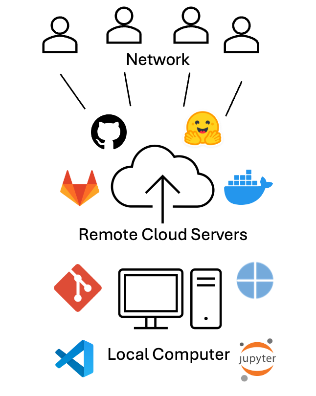
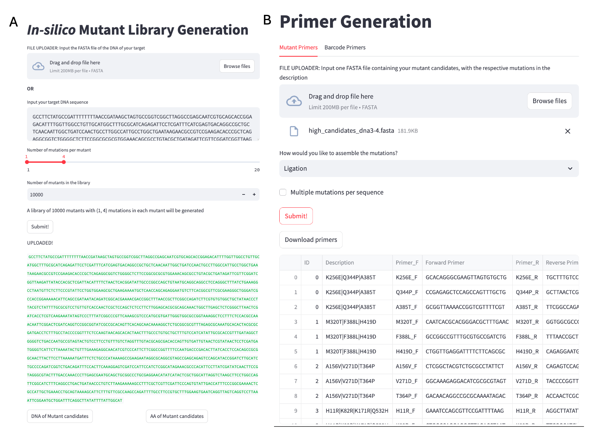
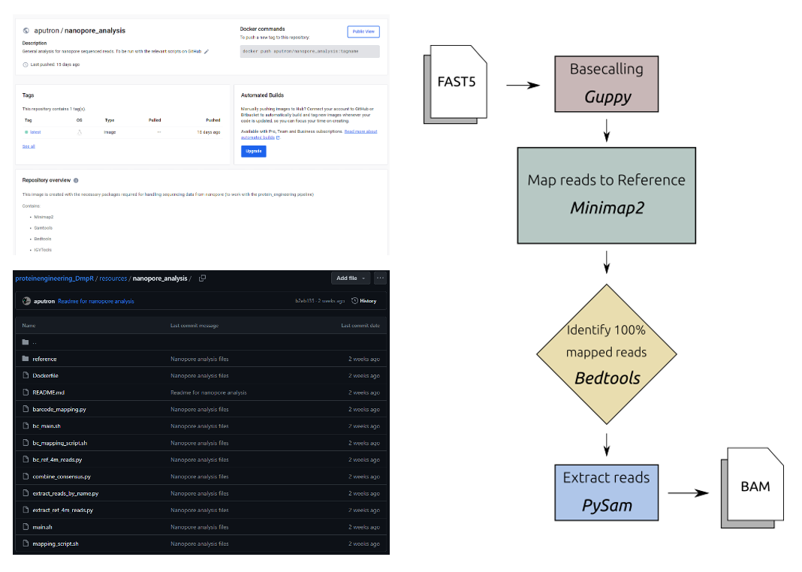
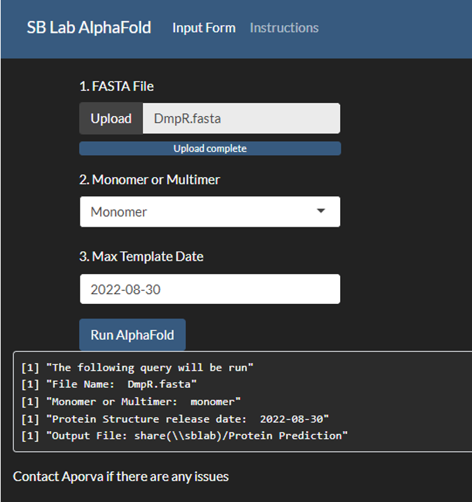
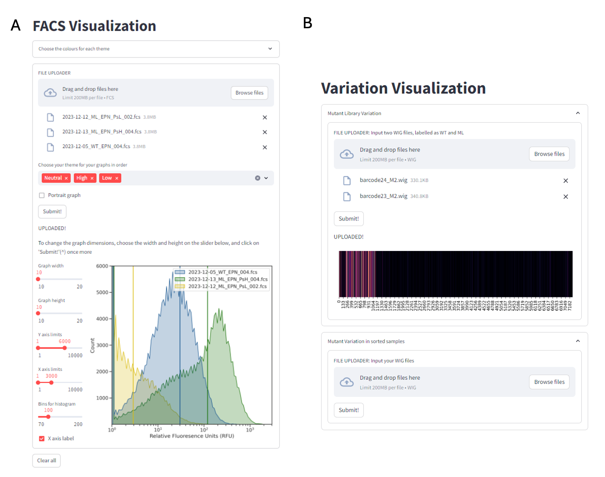

# Computational Tools for Streamlined Biofoundry Workflows

## Introduction

The Design-Build-Test-Learn (DBTL) cycle, a foundational methodology of synthetic biology, adopts engineering principles to enhance reproducibility and efficiency in biological research. Yet, the Build and Test phases pose considerable challenges to their labor-intensive and time-consuming nature. For instance, the assembly of three DNA fragments often requires a week per circuit assembly by a skilled graduate student. Furthermore, optimizing the expression of a gene with promoters, RBSs, and terminator parts - three different types for each – necessitates creating and testing 27 distinct DNA combinations. This process could extend a graduate student’s workload to four to six months for the construction of an optimal genetic circuit.

On an industrial scale, the Build and Test stages present similarly formidable challenges. The development and commercialization of Artemisinin, a treatment for malaria by Amyris, demanded an investment of \$15 million and ten years, equivalent to roughly 150 person-years. Similarly, DuPont's production of 1,3-propanediol required 575 person-years, highlighting the extensive resource commitment in synthetic biology projects \[1\]. These instances underline the significant time and labor investments needed to harness the benefits of synthetic biology, explaining why the field, which emerged in the early 2000s, took about a decade to prove its value.

The incorporation of robotics into biology has significantly reduced the manual labor and time constraints traditionally associated with biological experiments. This advancement was pioneered by Dr. Ross D. King in 2004 \[2\], who developed the robotic scientists Adam and Eve to autonomously investigate yeast metabolism and enzyme discovery \[3\]. Despite their innovative potential, the application of these robotic scientists has faced limitations due to the need for specialized automation equipment tailored for specific research projects. This requirement often limits the flexibility needed to conduct a wide array of complex biological experiments, leading to significant costs and efforts to adapt commercial equipment for various research needs.

However, the fundamental principles of synthetic biology, including standardized parts, assembly techniques, and an engineering-focused DBTL strategy, have demonstrated significant compatibility with automation and robotics. This synergy has not only enhanced research but also found practical industrial applications. A notable example is Lanzatech's production of ethanol from greenhouse gases using its clostridiaBiofoundry (cBioFab) \[4\], which combines cell-free systems with machine learning technology to achieve remarkable industrial breakthroughs \[5, 6\] in producing 1-hexanol and hexanoic acid (\>100x improvement).

A biofoundry integrates the entire DBTL cycle, from initial DNA design to testing cells modified with that DNA, by systematically linking automated hardware and software to streamline the process from gene synthesis to the final product. A key strategy in constructing an efficient biofoundry is the careful design of each DBTL stage to ensure seamless operation and eliminate bottlenecks, significantly improving development speed and throughput. For instance, Ginkgo Bioworks has shown considerable efficiency gains, with its throughput increasing two to four times annually between 2014 and 2020. In 2017, the company achieved a milestone when the cost of testing per strain became lower than that of manual handling \[7\]. Amyris, having launched its biofoundry in 2011, has successfully commercialized 15 new substances at a consistent rate over the last seven years \[8\], marking a productivity increase of more than twentyfold compared to its earlier efforts with Artemisinin. These developments underscore the transformative impact of biofoundries on synthetic biology, providing scalable and cost-efficient solutions for bioproduct development. By optimizing the bioproduct development process, biofoundries substantially reduce the time and cost associated with bringing new products to market, representing a significant advancement in biotechnological innovation.

## Considerations required for biofoundry development

### Hardware

The concept of a biofoundry often evokes images of automated robotics operating within a biological laboratory. Given this association, automation is deemed essential for the development of biofoundries. However, the deployment of advanced automation machinery, including robotic arms, in fully automated biofoundries requires careful attention to planning. While devices like liquid handlers are crucial for high-throughput well plate-based experiments, incorporating robotic arms with other automated devices, such as automated thermal cyclers or automated incubators, significantly raises both initial and ongoing maintenance costs. Adopting a semi-automated DBTL cycle is one of the strategies that offer maximum flexibility at minimal cost.

Currently, the availability of automated equipment is restricted to a handful of global companies. To broaden the options for users and ensure the provision of high-quality services, ongoing development of such equipment is essential. This necessitates long-term and continuous investment, supported by governmental policies, especially given the current limited market availability. The emphasis in hardware development should be on enhancing the connectivity and flexibility of devices to boost the overall efficiency of the DBTL cycle, rather than focusing solely on individual device specifications.

Furthermore, an increase in hardware throughput does not guarantee an improvement in overall biofoundry performance. One of the major reasons automated equipment may remain underutilized or idle in universities or research institutions is that data management and analysis are failed to keep pace with the hardware's throughput. In this context, the workflows and software discussed in the subsequent chapters are pivotal considerations prior to hardware deployment.

### Workflows

Before delving further into biofoundry development, it's necessary to define some key terms associated with biofoundry operation for ease of understanding. We introduce two fundamental terms: 'workflow' and 'unit process.' A unit process is the smallest protocol executed by an automated machine, while a workflow is a sequence of unit processes organized to produce a desired product. The terms 'protocol' and 'process' are employed broadly. Both unit processes and workflows can be formulated as standard operating procedures (SOPs) which are detailed instructions designed to standardize and enhance the reproducibility of operations.

In constructing a biofoundry, workflows are developed by re-optimizing established manual protocols. Manual protocols frequently overlook or oversimplify sample preparation, deemed apparent. Conversely, automated protocols demand more detailed specifications, including the quantity, position, and handing of reagents and equipment, especially when using multi-well plates.

Developing a workflow involves assessing the level of automation feasible with the available equipment and consumables. The initial level may resemble manual operations, progressing to the use of liquid handlers capable of managing experiments based on 96 or 384-well plates. Utilizing high-throughput equipment not only enhances experiment throughput but also improves reproducibility. Establishing quantitatively measurable metrics within the tier system is crucial for ensuring the reliability and interoperability of workflows.

To enhance a biofoundry's efficiency, it's essential to reduce the operational costs associated with workflows and enable the simultaneous running of multiple workflows, which is key to maximizing efficiency and productivity. This challenge can be tackled in two ways. One approach is consolidating samples onto a single plate when different researchers request the same workflow. Alternatively, when different workflows are requested, they can be integrated by considering the run times of each unit process and scheduled as a single workflow. These scheduling strategies, more suitable for semi-automated biofoundries, are essential for enhancing biofoundry performance, given the limited number of machines. Additionally, waste in research, often due to avoidable design flaws or incomplete experiments, is a significant concern. Over 50% of research remains unpublished, half of which is attributable to preventable errors \[9\]. An integrated biofoundry can minimize these mistakes by facilitating more informed decisions from a broader range of experiments.

### Key Gaps in workflows:

-   **Fragmented Workflows**: Many biofoundries have disjointed processes across different stages of research and production, making it challenging to maintain a seamless flow from design to implementation.

-   **Lack of Standard Operating Procedures (SOPs)**: Inconsistent or absent SOPs can lead to variability in experiments, making reproducibility difficult and complicating data comparison.

-   **Integration of Automation**: While automation is essential for scaling processes, many workflows do not fully integrate automated systems, leading to inefficiencies and increased manual work.

-   **Data Management and Sharing**: Ineffective data management practices can result in difficulties in data access and sharing among team members, hampering collaboration and progress.

-   **Feedback Loops**: There may be insufficient mechanisms for feedback between different stages of the workflow, preventing insights from experimental results from being effectively integrated into future designs.

-   **Cross-Disciplinary Collaboration**: Workflows often lack structures that promote collaboration across disciplines, which is crucial in a multidisciplinary field like synthetic biology.

-   **Real-Time Monitoring**: Many workflows do not incorporate real-time monitoring and analytics, which can help in making timely adjustments and decisions during experiments.

-   **Scalability Protocols**: Procedures for scaling up from lab-scale experiments to large-scale production are often underdeveloped, posing challenges for commercialization.

-   **Training and Onboarding**: Inefficient onboarding processes for new personnel can slow down productivity and lead to misunderstandings about protocols and workflows.

### Software

Despite the increasing necessity for constructing biofoundries, the availability of software specifically designed for biofoundry operations remains limited. While some existing solutions for Electronic Laboratory Notebooks (ELN) or Laboratory Information Management Systems (LIMS) \[10\] are available, they often do not meet the unique requirements of biofoundry operations comprehensively. Furthermore, the cost of these solutions can be prohibitive for use in an extensively scaled biofoundry environment with a large team.

Developing software for biofoundry operations is indispensable. Creating software that coordinates biological experiments across various stages of the DBTL cycle requires the collaborative, intensive efforts of IT engineers and biologists. To address this challenge, we advocate for a ‘rapid prototyping and soft integration strategy.’ This approach emphasizes the quick development of specific functionalities necessary for biofoundry operations and their integration with existing tools, like Snapgene and GitLab. Modern frameworks for developing web-based applications, such as Python's Streamlit or R's Shiny, are invaluable for rapidly producing streamlined software applications. Integrated Development Environments (IDEs) like Visual Studio Code (VSCode) or RStudio are instrumental in managing the entire DBTL cycle, thereby significantly boosting the efficiency and synchronization of biofoundry operations. This approach of ‘rapid prototyping and soft integration’ underscores the importance of continuous software maintenance and updates to support equipment and technological advancements, alongside evolving scientific interests.

Concerning the functional requirements of biofoundry software, a major challenge in biofoundry design is operational costs. It is imperative to reduce the consumption of consumables, time, and labor in individual workflows. Initially, efforts should concentrate on optimizing workflows within a semi-automated system. Software that persistently monitors the availability of automated equipment and materials plays a vital role in maximizing resource use and coordinating the execution of workflows from various users. Moreover, given the extensive number of samples processed by a biofoundry, its operational software must manage a significantly larger volume of equipment, materials, experiments, and operations than a conventional laboratory. This necessitates a seamless system to ensure equipment availability, smooth supply of materials, and swift data analysis for designing subsequent high-throughput experiments. Furthermore, constructing an operational system capable of controlling automated devices from diverse manufacturers requires APIs that can translate the interactions between user-designed workflows and automated equipment into a universally understandable language, such as JSON.

While these endeavors can be demanding and might necessitate collaboration with equipment vendors, initiating software development that monitors equipment status and suggests optimized workflows in a semi-automated system is feasible. The adaptability and compatibility offered by such a system are crucial for enhancing accessibility and interoperability among biofoundry facilities.

### Key Gaps in Software

-   **Data Integration**: Many biofoundries utilize disparate systems for data collection and analysis, leading to challenges in integrating and interpreting data from various sources.
-   **User-Friendly Interfaces**: Existing software often lacks intuitive interfaces, making it difficult for non-experts to use advanced tools and access data effectively.
-   **Collaboration Tools**: There is often a shortage of robust collaboration platforms that facilitate communication and project management among multidisciplinary teams.
-   **Standardized Workflows**: A lack of standardized software workflows can lead to inconsistencies in experimental processes and results, hindering reproducibility.
-   **Simulation and Modeling Tools**: Advanced tools for simulating biological processes and modeling systems biology are often limited or not user-friendly, which restricts their use in design and optimization.
-   **Automated Data Analysis**: There is a need for more sophisticated software solutions for automated data analysis and interpretation, particularly for large datasets generated by high-throughput experiments.
-   **Visualization Tools**: Enhanced visualization software is often needed to effectively represent complex biological data and results, making them more accessible to researchers and stakeholders.
-   **Version Control**: Effective version control systems for experimental protocols, data, and software tools are often not well-integrated, leading to potential errors and confusion.
-   **Interoperability**: Many biofoundry software tools lack interoperability, making it difficult to exchange data and functionalities between different platforms and tools
-   **Regulatory Compliance**: Software solutions that aid in ensuring compliance with regulatory requirements are often lacking, making it difficult to manage documentation and quality control.

## Computational Tools:

### Tools for Data Logging and Collaboration:

{width="352"}

#### Electronic Lab Notebooks:

Electronic Lab Notebooks (ELNs) are essential tools in modern research environments, offering several key advantages over traditional paper notebooks. They facilitate efficient data management by allowing researchers to easily organize, store, and retrieve experimental data. ELNs enhance collaboration among team members by enabling real-time sharing and commenting on data, which fosters greater communication and collective insights. Moreover, they improve data integrity and reproducibility through built-in version control and automated backups, reducing the risk of data loss or errors. ELNs also streamline compliance with regulatory requirements by providing secure, auditable records of experiments. Additionally, their integration with other digital tools and platforms can enhance workflows and automate routine tasks, ultimately increasing productivity and accelerating the research process\[10\].

While there are free options for ELN software, many vendors limit data storage, file sizes, and the number of users, which can hinder larger teams or projects. Portability of files can also be a concern depending upon the ELN provider; for example if it ceases operations or raises prices, users may only receive a PDF export of their data, complicating transitions to other platforms. Although infrequent, security breaches, are a potential risk that users should be aware of. Additionally, not all electronic solutions cater to every lab's needs; for example, some ELNs do not integrate with specific biotools like CRISPR/Cas9 genome editing software. Furthermore, user experience can vary significantly; many reviews point out issues with nonintuitive interfaces and the need for extensive training, which can slow down effective implementation in the lab \[11\].

Here, we describe using Visual Studio (VS) Code along with quarto markdown files as an ELN. VS Code is compatible with most types of files. VS Code allows for the creation of Markdown files, which can be used to document experiments, protocols, and results in a structured and easily readable format. The built-in version control system (Git) enables users to track changes over time, making it simple to maintain a history of experiments and revisions. Open-sourced extensions allow integration of other software such as Docker, GitHub, and Notion which can be standardized through a free account.

Moreover, integration of Jupyter Notebooks allow for interactive data analysis and visualization, integrating coding directly with documentation. This can be particularly useful for analyzing data using programming languages such as Python or R. Users can also benefit from VS Code's robust search capabilities, making it easy to locate specific notes or data points across multiple files. Overall, using VS Code as an ELN combines flexibility, organization, and collaboration, making it a compelling choice for researchers looking to streamline their documentation processes.

#### Version Control:

Collaboration is streamlined on GitHub, as multiple team members can work on the same project simultaneously. Additionally, the ability to store files in cloud-based repositories (like GitHub or GitLab) ensures data portability and accessibility, even if the original workspace changes. This allows users to track changes over time, providing a clear history of modifications, which is essential for reproducibility and accountability. Users can create branches to explore new ideas or experiment with changes without affecting the main content. Pull requests enable thorough discussions and reviews of proposed changes before merging, ensuring that all contributions are vetted and enhancing the quality of the documentation.

GitHub also supports Markdown, making it easy to format notes for clarity and readability. With features like issue tracking, users can manage tasks and monitor project progress efficiently. The platform’s cloud-based storage ensures that data is accessible from anywhere, minimizing the risk of loss. Overall, using GitHub for version control in an ELN not only improves organization and collaboration but also enhances the integrity and transparency of the research process.

Using Docker to share workflow environments offers a powerful solution for ensuring consistency and reproducibility in research and development projects. Docker allows users to create containerized environments that encapsulate all necessary dependencies, libraries, and configurations required to run a specific application or workflow. This means that researchers can share their entire computational environment, ensuring that collaborators can run the same code with the same results, regardless of their local setups.

By creating a Docker image, users can package their workflows along with any required software, making it easy to distribute and deploy on any system that supports Docker. This eliminates the common "it works on my machine" problem, as the container will behave the same way on any platform. Additionally, Docker supports versioning, allowing teams to track changes in their environment over time and roll back to previous configurations if needed. \[12, 13\]

Models and datasets can be uploaded on AI sharing platforms such as Huggingface.

### Design Tools:

When managing a large number of samples, the design of DNA fragments can become a complex and cumbersome process. This challenge is exacerbated by the need to ensure specificity and efficiency in fragment design, which is crucial for downstream applications such as cloning, sequencing, or synthetic biology. As sample numbers increase, the potential for human error also rises, leading to inconsistencies that can compromise experimental outcomes. Moreover, the iterative nature of fragment design often necessitates multiple rounds of optimization, further extending the time and resources required for successful implementation. Consequently, the integration of automated design tools and software that can handle bulk DNA fragment design may prove invaluable. Such tools can streamline the process, enhance accuracy, and significantly reduce the workload associated with designing DNA fragments across numerous samples, thereby improving overall productivity in molecular biology workflows.



#### *In-silico* Mutant Generator:

Optimizing DNA fragments in synthetic biology is a crucial step in the development of efficient and functional biological systems, necessitating the creation of a diverse array of mutant candidates to explore variations that can enhance performance. The traditional approaches to generating these mutants are often labor-intensive and resource-consuming, posing significant challenges in terms of time and scalability. In response to these limitations, we have developed an innovative in-silico mutant library generator that harnesses computational power to simulate a broad spectrum of mutations across selected DNA sequences. This generator creates a library of a predefined size introduces various types of mutations, including point mutations, insertions, and deletions in each mutant. By integrating it with machine learning approaches trained on extensive datasets, this tool can be used to identify appropriate optimized candidates.

```         
# Pseudocode for in-silico mutant generator
INPUT: Target DNA Sequence (FASTA file / string) 
OUPUT: Mutant Library (FASTA file)

FUNCTION GenerateMutantLibrary(originalSequence, mutLibSize, numMutants):
    mutantLibrary = []  # List to store mutants

    FOR x FROM 1 to mutLibSize:
        FOR i FROM 1 TO numMutants:
            # Start with the original sequence
            mutantSequence = originalSequence  

            # Mutate a random sequence with random base
            position = RandomPosition(originalSequence.length)
            newBase = RandomBase(exclude=originalSequence[position])
            mutantSequence[position] = newBase
    
            # Store mutant DNA and AA sequences
            mutantLibrary.append((DNAmutantSequence, AAmutantSequence))

    RETURN mutantLibrary
```

A simple user interface (UI) for the algorithm is available at <https://insilicomutantlib.streamlit.app/>

#### Primer design:

Site-directed mutagenesis (SDM) is a technique used to introduce specific nucleotide changes into a DNA sequence, allowing researchers to study gene function, protein interactions, and other biological processes. Automating the primer design process for SDM can significantly enhance efficiency and accuracy. The algorithm generates primers in a way that accommodates various assembly techniques, including Gibson assembly, staggered Gibson assembly, and ligation assembly, for site-directed mutagenesis (SDM). For Gibson assembly, the primers are designed to be completely overlapping regions with the target mutation at the middle, facilitating the seamless integration of DNA fragments in a single reaction. In the case of staggered Gibson assembly, the algorithm designs one primer with the mutated base, and the other primer has 10bp of a flanking region. For ligation assembly, the primers are crafted to produce compatible ends, ensuring effective joining of the mutated fragments using DNA ligase. The tool can generate primers for a large number of mutants, even those containing multiple mutations, using the output from the in-silico mutant library. This capability is particularly advantageous in high-throughput experimental settings where researchers aim to explore a diverse array of genetic modifications simultaneously.

The tool also designs primers for multiplexed barcode sequencing, a process elaborated upon in Chapter 4. Users can input their specific target sequences into the tool, which then generates complementary primers optimized for those sequences. A key feature of this tool is its ability to incorporate pre-defined barcodes into the primers, allowing for the simultaneous analysis of multiple samples in a single sequencing run.

First, the melting temperature (Tm) is carefully calculated and adjusted to promote efficient annealing to the target DNA. This optimization helps ensure that the primers will bind effectively under the chosen PCR conditions, thereby increasing the likelihood of successful amplification. Additionally, the GC content of each primer is tailored to fall within an ideal range, typically between 40% and 60%. This balance enhances the stability of the primer-template duplex, improving the fidelity of the resulting PCR product. Importantly, the design process avoids incorporating thymine at the 3' end of the primers, as this can lead to non-specific binding and reduced efficiency in the amplification process.\

```         

# Pseudocode for primer design for SDM
FUNCTION DesignPrimers(targetSequence, mutation, assemblyType):
    # Initialize empty lists for primers
    forwardPrimer = []
    reversePrimer = []

    # Determine mutation position
    mutationPosition = FindMutationPosition(targetSequence, mutation)

    # Generate forward primer with mutation
    IF assemblyType == "Gibson Assembly":
        forwardPrimer = [mutationPosition - 10:mutationPosition] + mutation + [mutationPosition:mutationPosition + 10]
        reversePrimer = reverseComplementaryDNA(forwardPrimer)
        forwardPrimer_final, reversePrimer_final = optimizePrimers(forwardPrimer, reversePrimer)
    
    ELSE IF assemblyType == "Staggered Gibson Assembly":
        forwardPrimer = [mutationPosition - 10:mutationPosition] + mutation + [mutationPosition:mutationPosition + 15]
        reversePrimer = reverseComplementaryDNA(mutationPosition:mutationPosition + 15)
        forwardPrimer_final, reversePrimer_final = optimizePrimers(forwardPrimer, reversePrimer)

    ELSE IF assemblyType == "Ligation Assembly":
        forwardPrimer = [mutationPosition - 10:mutationPosition] + mutation + [mutationPosition:mutationPosition + 10]
        reversePrimer = reverseComplementaryDNA(mutationPosition + 10: mutationPosition + 30)
        forwardPrimer_final, reversePrimer_final = optimizePrimers(forwardPrimer, reversePrimer)

    RETURN (forwardPrimer_final, reversePrimer_final)


FUNCTION PrimersMutantLibrary(FASTAfile, mutations, assemblyType)   
    sequences = read(FASTAfile)
    primerList = []

    FOR sequence in sequences:
        FOR eachMutation in mutations:
            primers = DesignPrimers(sequence, eachMutation, assemblyType)
        primerList = [primers]

    RETURN (primerList)
    
```

```         

# Pseudocode for barcode primer design
FUNCTION BarcodePrimers(frontPrimer, reversePrimer, forwardBarcodeList, reverseBarcodeList):
    FOR barcode in forwardBarcodeList:
        barcodedForwardPrimer = frontPrimer + barcode
    forwardPrimerList = [barcodedForwardPrimer]

    FOR barcode in reverseBarcodeList:
        barcodedReversePrimer = reversePrimer + barcode
    reversePrimerList = [barcodedReversePrimer]

    forwardPrimer_final, reversePrimer_final = optimizePrimers(forwardPrimerList, reversePrimerList)

    RETURN (forwardPrimer_final, reversePrimer_final)
```

A simple user interface (UI) for the algorithm is available at <https://mutprimergen.streamlit.app/>

### Machine Interoperability:

Most automated machines feature user interfaces designed to facilitate the mapping of wells for essential laboratory tasks such as aspirating, dispensing, and mixing liquids. These interfaces simplify the process by allowing users to visually select and configure the wells according to their experimental needs. Additionally, many of these systems can operate using CSV (Comma-Separated Values) files, which contain critical information, including Source Well, Destination Well, and Volume. When faced with complex workflows involving numerous samples, utilizing an automated script to map the samples in a CSV file can significantly enhance efficiency and accuracy. Workflows can be organized to work continuously in this manner. The script for the same is available on <https://github.com/aputron/streamlitapps/tree/main>

### Analysis Tools:

#### Nanopore Analysis:



### Accesibility to Modelling Tools:

Simulation and modeling tools play a crucial role in understanding and optimizing biological processes, particularly in fields like systems biology, synthetic biology, and drug development. However, many of these advanced tools are often limited in accessibility and user-friendliness, which can restrict their widespread adoption and effective use in research and application.

Many of the available tools require specialized knowledge of programming and mathematical modeling, creating a steep learning curve for researchers who may not have a strong computational background. This can discourage scientists from utilizing these tools, even when they could significantly enhance their research. Additionally, some tools may lack comprehensive documentation or user support, making it difficult for users to troubleshoot issues or fully leverage the tool's capabilities.

Even when large models are made accessible on platforms like Google Colab, such as ColabFold, their functionality can be limited due to several factors. Firstly, computational resources on free or tiered cloud platforms may be restricted, leading to longer processing times or the inability to run particularly large or complex models that require significant computational power. This limitation can frustrate users who need to conduct extensive simulations or analyses. Additionally, Colab's environment may not support all the necessary libraries or specific versions of software that users require for their models. While Colab offers a range of pre-installed packages, researchers may still encounter compatibility issues, requiring extra time to set up their environments properly. Furthermore, the reliance on internet connectivity can also pose challenges. Interruptions or slow connections can hinder users’ ability to run or save their work, potentially resulting in data loss or incomplete analyses \[14\]. Having locally hosted databases and models downloaded allows for more accurate analysis and predictions \[15\].

To address these challenges, there is a growing need for more intuitive simulation and modeling tools that offer user-friendly interfaces and robust support for data integration. Enhancements such as visual modeling environments, drag-and-drop functionalities, and real-time feedback can make these tools more accessible to a broader audience. Furthermore, fostering collaborations between computational scientists and biologists can help ensure that the tools developed are tailored to the specific needs of the research community. \[16\]

#### AlphaFold/RosettaFold UI:

{width="255"}

### Visualization Tools:

Biological data can be intricate and multidimensional, often involving large datasets from experiments such as genomics, proteomics, and metabolomics. Visualization tools help translate this data into graphical formats, making it easier for researchers to identify patterns, trends, and anomalies that might not be apparent in raw data. \[17\]

These tools facilitate exploratory data analysis, allowing scientists to visualize relationships and interactions among biological variables. For instance, network diagrams can depict interactions between proteins, while heatmaps can show gene expression levels across different conditions, helping researchers draw meaningful conclusions and generate hypotheses. \[18,19, 20\]



#### FACS Visualization:

Proprietary tools, such as FlowJo, FCS Express, and Kaluza, have emerged as the predominant solutions for flow cytometry analysis, and their widespread adoption can be attributed to several key factors. These tools provide a robust and intuitive user experience (UX), which enhances usability and facilitates efficient data interpretation. Additionally, they lower the barrier to entry for users, making the technology more accessible to individuals with varying levels of expertise. Furthermore, the extensive documentation and support resources available for such tools enable users to navigate the complexities of flow cytometry with greater confidence and ease. Despite their advantages, proprietary tools for flow cytometry analysis have high licensing costs, learning curve for new users given the depth of features, and lag times with large datasets. Often, the resulting files aren’t standardized enough to enable robust integration with downstream applications like electronic lab notebooks.

In this thesis, we utilize the open-sourced python library, FlowCal to extract the data from fcs files and can be used to make informed decisions on downstream processes.

A simple user interface (UI) for the algorithm is available at <https://facsvisualization.streamlit.app/>

#### Mutant Variability Visualizer:

Directed evolution is a widely employed strategy for optimizing bio-parts, allowing researchers to enhance their functionality by exploring a diverse array of mutations within a given library. This thesis mainly focuses on analyzing long-read sequencing results derived from these mutant libraries, which provide comprehensive insights into the genetic variations present. By leveraging the advantages of long-read sequencing, the research can capture complex structural variations and facilitate the assembly of more complete sequences. Visualizing the variation within these libraries becomes crucial, as it allows for a more intuitive understanding of the data, making it easier to identify patterns and correlations between specific mutations and their resulting phenotypes. This visualization aids in pinpointing advantageous traits and helps guide subsequent rounds of evolution, ultimately driving the optimization process more efficiently.

Here, the variance in WT sequenced reads are used as a threshold for the error rate in the mutant library.

The variation $v$ at a specific position $i$ can be defined as:

$$ v_i = {\sum n_i' \over n_i} * 100 $$

where $n_i'$ are the occurrences of all nucleotides excluding WT and $n_i$ are the occurrences of the WT nucleotides at position $i$ in a sequence run of a single population.

We define the variation of the $i$th nucleotide in the mutant library as:

$$ V_i = ({\sum ml_i' \over ml_i} * 100 ) - ({\sum wt_i' \over wt_i} * 100 ) $$

where $ml$ refers to the mutant library sequenced samples and $wt$ refers to the the WT sequenced samples.

A simple user interface (UI) for the algorithm is available at <https://libraryanalysis.streamlit.app/>

### Tools for Data Storage and Sharing:

#### Server Management:

## Methods

All applications were developed on Python version 3.11.0. and all public applications were made on Streamlit version 1.39.0. The AlphaFold2 user interface was developed using ShinyR.

# References

1.  Hodgman CE, Jewett MC (2012) Cell-free synthetic biology: thinking outside the cell. Metab Eng 14:261–269. https://doi.org/ 10.1016/j.ymben.2011.09.002

2.  King RD, Whelan KE, Jones FM et al (2004) Functional genomic hypothesis generation and experimentation by a robot scientist. Nature 427:247–252. https://doi.org/10.1038/nature02236

3.  King RD, Rowland J, Oliver SG et al (2009) The automation of science. Science 324:85–89. https://doi.org/10.1126/science. 1165620

4.  Köpke M, Simpson SD (2020) Pollution to products: recycling of “above ground” carbon by gas fermentation. Curr Opin Biotechnol 65:180–189. https://doi.org/10.1016/j.copbio.2020.02.017

5.  Vögeli B, Schulz L, Garg S et al (2022) Cell-free prototyping ena- bles implementation of optimized reverse β-oxidation pathways in heterotrophic and autotrophic bacteria. Nat Commun 13:3058. https://doi.org/10.1038/s41467-022-30571-6

6.  Kim KJ, Lee SJ, Kim DM (2023) The use of cell-free protein synthesis to push the boundaries of synthetic biology. Biotechnol Bioprocess Eng. https://doi.org/10.1007/s12257-022-0279-2

7.  Kelly J (2022) Grow with ginkgo. Ginkgo Bioworks. https://s28. q4cdn.com/823357996/files/doc_presentations/2022/01/2022.01. 12-Ginkgo-DNA-JPM-2022.pdf.

8.  <https://www.cowen.com/transactions/amyris-inc-6-4-2020/>

9.  Sogi GM (2023) Research waste. Contemp Clin Dent 14:179.

10. Kwok R (2018) How to pick an electronic laboratory notebook. Nature 560:269–270. https:// doi. org/ 10. 1038/ d41586-018-05895-3

11. <https://www.idtdna.com/pages/community/blog/post/thinking-about-making-the-switch-to-an-electronic-lab-notebook-here-are-some-pros-and-cons>

12. David Eyers, Sarah Stevens, Andy Turner and Jeremy Cohen, Containers for reproducible research. <https://github.com/ImperialCollegeLondon/2020-07-13-Containers-Online/blob/gh-pages/CITATION>

13. Leahy, Darragh, and Christina Thorpe. "Zero trust container architecture (ztca): A framework for applying zero trust principals to docker containers." *International Conference on Cyber Warfare and Security*. Vol. 17. No. 1. 2022.

14. Mirdita, M., Schütze, K., Moriwaki, Y., Heo, L., Ovchinnikov, S. and Steinegger, M., 2022. ColabFold: making protein folding accessible to all. *Nature methods*, *19*(6), pp.679-682.

15. Jumper, J., Evans, R., Pritzel, A., Green, T., Figurnov, M., Ronneberger, O., Tunyasuvunakool, K., Bates, R., Žídek, A., Potapenko, A. and Bridgland, A., 2021. Highly accurate protein structure prediction with AlphaFold. *nature*, *596*(7873), pp.583-589.

16. Eblen-Zayas, M., 2015. Comparing electronic and traditional Lab Notebooks in the advanced lab. In *Conference on Laboratory Instruction: Beyond the First Year of College, College Park, MD. Retrieved from https://www. compadre. org/Repository/document/ServeFile. cfm*.

17. Wong, B., 2012. Visualizing biological data. *Nat Methods*, *9*(12), pp.1131-1131.

18. <https://github.com/keller-mark/awesome-biological-visualizations>

19. Verschaffelt, P., Collier, J., Botzki, A., Martens, L., Dawyndt, P. and Mesuere, B., 2022. Unipept Visualizations: an interactive visualization library for biological data. *Bioinformatics*, *38*(2), pp.562-563.

20. Kerren, A., Kucher, K., Li, Y.F. and Schreiber, F., 2017. BioVis Explorer: A visual guide for biological data visualization techniques. *PLoS One*, *12*(11), p.e0187341.

21. White, S., Quinn, J., Enzor, J., Staats, J., Mosier, S.M., Almarode, J., Denny, T.N., Weinhold, K.J., Ferrari, G. and Chan, C., 2021. FlowKit: a python toolkit for integrated manual and automated cytometry analysis workflows. *Frontiers in immunology*, *12*, p.768541.

# Changes

> In the context of a biofoundry that necessitates the development of diverse workflows tailored to multiple applications, the adoption of open-source software is critical. Open-source solutions offer the advantage of seamless integration with various modules, enabling researchers to construct adaptable and efficient workflows.
>
> This intuitive web-based interface allows users to easily interact with the in-silico mutant library generator without the need for extensive programming knowledge. Users can input their original DNA sequences and select various mutation types, including point mutations, insertions, and deletions. The UI provides clear instructions and feedback throughout the process, ensuring that even those new to synthetic biology can navigate the tool effectively.
>
> Additionally, the interface includes features such as real-time performance predictions and the ability to download generated mutant libraries for further analysis. By streamlining the user experience, this UI empowers researchers and practitioners to efficiently explore genetic modifications, accelerating their efforts in DNA optimization and synthetic biology applications. Whether for academic research or practical applications, this tool makes the process of generating and evaluating mutant candidates more accessible and user-friendly.