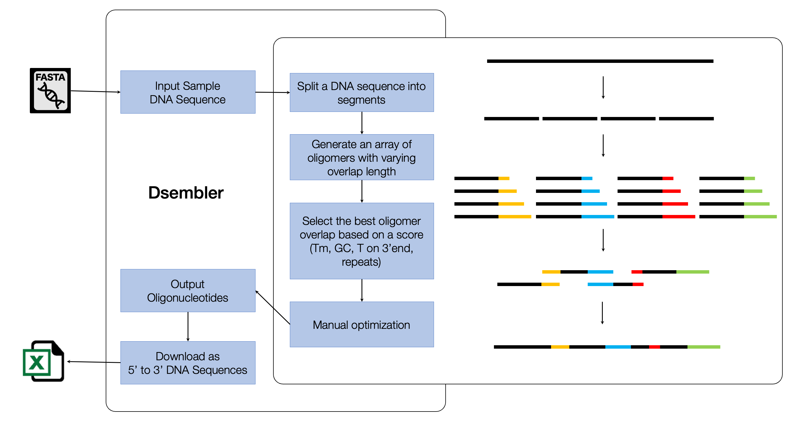

# Assembling Long-DNA

## Introduction

The field of synthetic biology has garnered significant global interest owing to its diverse applications in bio-based production, biosensing, living therapeutics, and drug delivery. This heightened interest has subsequently increased the demand for novel protein synthesis and, ultimately, genome-scale assemblies. However, gene assembly from oligomers presents several challenges, including the risk of incorrect assembly between oligomers, self-annealing, and the potential for insertions or deletions resulting from mis-annealed oligomers. Dsembler (DNA Assembly Designer) is a web-based software application designed to minimize errors during DNA assembly processes. By enhancing the accuracy of oligomer design, Dsembler addresses critical challenges in synthetic biology and supports advancements in genetic engineering and molecular biology applications.

The primary objective of synthetic biology is to design and construction of biological systems that fulfill specific, pre-determined functions. These can include minimal genome organisms such as JCV-syn3.0 [@hutchison2016design], or viruses [@venter2022synthetic], or even protein sequences[@rapp2024self]. Progress in this field is heavily reliant on the ability upon the ability to assemble short oligomers, which are essential for creating customizable and functional DNA strands. The declining costs of DNA synthesis, alongside advancements in computational capabilities, have facilitated rapid developments in the construction of increasingly longer DNA sequences. Several DNA assembly techniques, such as polymerase chain assembly (PCA), Gibson Assembly, and Golden Gate Assembly, have been developed and continue to be improved[@hughes2017synthetic]. However, as DNA assemblies become longer, the physical constraints of successful assembly also increase progressively. The total number of errors occurring within an assembly could be reduced by optimizing oligomer design and minimizing the number of errors at this earlier step.

Although there are numerous software offering the design and analysis of short fragments of DNA, such as primers[@hendling2019silico; @richardson2006genedesign; @richardson2010genedesign], there has been a deficit in oligomer design tools, specifically to construct DNA assemblies. Currently publicly available software is limited in number and range of functionality, such as GeneDesign, DNAworks, and Gene designer, that mainly focus on melting temperature (Tm) and GC content overlap[@richardson2010genedesign; @villalobos2006gene; @hoover2002dnaworks].

Here, we report a novel software tool, Dsembler (DNA Assembly Designer), which focuses on optimizing oligomer sequences for longer double strand DNA with PCA/Gibson *de novo* DNA assemblies. Dsembler generates appropriate assembly oligomers for a given sequence under specified conditions. It also provides possible causes of errors for each oligomer and visualization of the overlaps, which allows users to make more informed decisions regarding their experimental design. The software is available at <http://223.130.146.86:8088/>.

## Consideration for designing oligomers

Dsembler was initially developed using Python (3.8.5), with the web-user interface supported by Flask, and database storage by SQLite which was later upgraded to R (version 4.1.2) with a lightweight Shiny web user interface and MongoDB database storage, utilizing the mongolite package. Users can navigate through the simple Dsembler web interface using Docker or on their local network. By receiving inputs for the target DNA sequence, oligomer size, overlap size, and melting temperature range, a set of oligomers can be designed. Users can download XLSX or FASTA files containing their respective oligomers. The pipeline is shown in (@fig-dsembler).

{#fig-dsembler}

### Designing optimized oligomers

The main considerations of Dsembler while optimizing oligomers includes: 1) Designing oligomers while avoiding possible errors in a DNA assembly. The central idea of the algorithm is to generate an array of candidate oligomers within the given parameters and select the ones that best fit the parameters (Figure 1). Ideally, they should not contain thymine as the last nucleotide of the 3’ end, have an overlap GC content between 40-60%, and a Tm within the range specified by the user. If no oligomers are suitable, the next best fit is provided along with a warning. Tm is calculated based on the Nearest Neighbor Equation supported by the SantaLucia[@santalucia2004thermodynamics] thermodynamic table[@panjkovich2005comparison]. 2) Dsembler prevents the false assembly of oligomers that share complementary base pairs between their overlaps. Consecutive oligomers are grouped and segregated based on the presence of repeated sequences (10bp) between the overlap of oligomers in each group. 3) A penalty score that assesses the assembly errors is provided in advance. The scores of each oligomer are calculated by a weighted sum of possible causes of error that may occur during assembly. This is presented in the following equation:

Where *T~t~* and *T~c~* are the target overlap Tm and the calculated overlap Tm respectively, 1~*T*~ represents an indicator function, which is one if the base at the 3¢ end of the oligomer is a Thymine; otherwise, it is zero. *GC~clamp~* refers to the number of GC clamps in the overlapping region. *R~within~* represents the number of repeated base pairs within each oligomer. *R~between~* represents the number of repeat base pairs between overlaps in a cluster. A theoretically faultless oligomer that fits all target parameters will have a score of zero.

4)Lastly, Dsembler provides six distinct error codes accompanied by a corresponding score for each oligomer. This feature enables users to adjust parameters to facilitate a more reliable and error-resistant assembly process

## Psuedocode

```         
INPUT dna_seq, oligo_size, overlap_size, tm, tm_range

rough_oligo_size=oligo_size – overlap_size 
high_overlap_size = overlap_szie + n 
low_temp = tm – tm_range
high_temp = tm + tm_range

FOR length(dna_seq) at rough_oligo_size intervals rough_oligomers = oligo_splice()

FOR overlap in range(overlap_size, high_overlap_size) candidate_oligomers = ADD overlap to rough_oligomer

IF candidate_oligomers
    T at 3' end = FALSE
    low_temp =< overlap_tm =< high_temp
    40 =< overlap_GC% =< 60 
    final_oligomers = candiate_oligomer

IF NOT repeats in final_oligomers 
    cluster = final_oligomers

OUTPUT oligomers.xlsx, oligomers.fasta
```

## User Interface

Users can register on Dsembler to store, manage, and analyze their queries effectively (Figure 2). The “Project” tab enables users to manage queries on a project-specific basis. The “Sample” tab allows for the upload of DNA sample files in FASTA format or directly via a dialog box. Within the "Design" tab, users can design oligomers by specifying preferred conditions, including melting temperature (Tm), maximum oligomer length, and maximum overlap length for the uploaded samples. The "Assembly" tab offers a visualization of the assembled DNA data through tables and graphs, with the option to download results in Excel format. Error information for each oligomer is also provided in this section. Finally, the "Optimizer" tab allows users to manually optimize oligomers identified as error prone. The resulting oligomers are presented as 5' to 3' sequences in CSV format, facilitating the ordering of synthetic DNA.

## Results

An initial comparative study was conducted to evaluate the performance of manually designed oligomers, GeneDesign[@richardson2010genedesign], and Dsembler. Oligomers corresponding to a predefined 520 bp fragment from the M13 bacteriophage genome were designed using these three approaches and subsequently synthesized and assembled via Polymerase Chain Assembly (PCA). The parameters for the oligomer design were set to an expected size of 50 bp, an overlap size of 20 bp, and a melting temperature (Tm) of 56 °C.

The effectiveness of the three design methodologies was assessed by analyzing their insertion and deletion rates (errors per kilobase) following sequencing of the assembled DNA derived from the colonies. Additionally, the proportion of randomly sampled colonies exhibiting no errors was evaluated.

For this sequence assembly, Dsembler was seen to be relatively successful with no insertions recorded and minimal deletions (0.38 ± 0.5 errors/kbp). The error rate for Dsembler oligomers was significantly lower than that observed for GeneDesign (2.02 ± 1.0 errors/kbp) and manually designed oligomers (0.67 ± 0.6 errors/kbp). Furthermore, the proportion of error-free colonies generated from Dsembler oligomers (83%) was comparable to that of manually designed oligomers (71%), and more than double that of GeneDesign oligomers (33%). These findings highlight the enhanced reliability of Dsembler in oligomer design and assembly.

Lower error rates along with a high proportion of error free colonies imply fewer experimental steps during assembly, particularly for error corrections. This would accelerate long DNA assembly and be useful for high throughput protocols.


Dsembler was also integrated with the K-biofoundry to scale up the assembly of longer DNA sequences (Methods). The established tool DNAworks was used to compare the efficacy of Dsembler. Both tools were used to design fragments of the AurI gene from Bacteroides thetaiotaomicron.\
The designed gene fragments were synthesized and subsequently assembled using PCA. The assembled gene fragments were analyzed with a fragment analyzer to assess the success and accuracy of the assembly. Oligomers from both Dsembler and DNAworks were successfully assembled. Although the assemblies by DNAworks had the correct sizes, they also showed the presence of non-target DNA sequences which could be attributed to incorrect assemblies.  The quality and efficiency of the assembly process were found to be comparable between the two tools.

## Discussion

Efficient oliogmer design is the foremost step to a lucrative assembly. Our DNA Assembly Designer, Dsembler, has a straightforward and streamlined algorithmic design to produce optimized oligomers for gene or genome based assemblies. It has an easy to navigate user interface, with default values to guide the user at all fronts. More parameters may be incorporated in the future, such as identifying any secondary structures, codon optimization, insert-backbone based assembly. Lastly, as the Design, Build, Test, Learn cycle advises, evaluating Dsembler outputs and resulting assemblies can help improve and fast-track genome assemblies. Dsembler in combination with the generated sequences from chapter 4 will prove to be a powerful tools for protein engineering as well.

## Materials and Methods

All PCA reactions were performed with Pfu Polymerase (Bioneer, Daejeon, S. Korea) and PCR reactions used KOD polymerase (TOYBO, Osaka, Japan). All enzymatic reactions were performed using the Biometra TRobot II automated PCR cycler (Analytik Jena, Germany).

### Target DNA sequences and Oligomer Design

The M13 bacteriophage (GenBank Accession No.: NC_003287.2) fragment used to test efficacy was obtained by basic splicing of the M13 bacteriophage genome into 520bp segments. The second fragment, i.e. 521-1041 bp, was used for this study. For all design methods, the target oligomer size was 50bp with an overlap of 20bp and an overlap Tm of 56 °C. While manually designing oligomers, the oligomer that fit the required criteria best was selected. This method is similar to the workflow of Dsembler, however, there were limited candidates to choose from, as designing such sequences was a laborious task. Twenty oligomers were designed by Dsembler, 18 by GeneDesign, and manually for the M13 bacteriophage fragment.

The AurI gene was obtained from the Bacteroides thetaiotaomicron VPI-5482 strain (Genbank Accession No: AE015928). For DNAWorks, the annealing temperature was set to 62°C and the oligo length to 90nt. For Dsembler, parameters included a maximum oligomer length of 90nt, a maximum overlap length of 40bp, and a Tm for 5'/3' overlap set at 58°C.

### M13 DNA Assembly

The protocol used to compare the oligomers designed manually, and using GeneDesign and Dsembler were the same, and the assemblies were performed under the same conditions. Individual oligomers (Macrogen, S. Korea) were synthesized and pooled depending upon the respective design method. Then, a PCA reaction was performed on each of the oligomer pools. To amplify the yield and select the correct assembly, PCR was performed using the first and last oligomers as forward and reverse primers. The appropriate sequence was extracted using gel extraction, and the resulting sequences were cloned into a T-vector (Solgent, Daejeon, S. Korea) coupled with the lac operon (with kanamycin and ampicillin resistance genes) using Gibson Assembly (NEB, Ipswich, Massachusetts, USA). *E. coli* DH5α cells were transformed with the plasmid vector and incubated on an LB agar plate containing 50 mg/ml, 40mg/ml, 10mg/ml, 5mg/ml of IPTG (Duchefa Biochemie, Haarlem, Netherlands), X-gal (Bioneer, Daejeon, S. Korea), ampicillin, and kanamycin (Sigma-Aldrich, St. Louis, Missouri, USA) respectively, overnight. White colonies, that signified a successful Gibson Assembly, were randomly picked, and underwent a plasmid miniprep (Promega, Madison, Wisconsin, USA). The final DNA was sequenced using Sanger sequencing (Macrogen, S. Korea), and the obtained sequences were checked for errors.

For each sequence, the insertions and deletions were counted and averaged across each design method to determine the number of errors per 520bp, which was then adjusted to errors/kbp. The number of colonies without any errors in the assembled sequences were also counted.

### AurI DNA Assembly

All experiments were performed with the hardware available at K-biofoundry. The workflow involved designing with both tools, ordering oligo pools from Bioneer (S. Korea). Oligos were dissolved in TE buffer to a final concentration of 2 pmol/µl in a total volume of 500 µl using Janus G3 Liquid handler (Revvity, MA), which were stored in 384-well plate. The PCA mix was aliquoted into a 96-well PCR plate (BIORAD) and the oligo-pools were transferred using and Echo 525 (Beckman Coulter, IN) according to their respective final concentrations (2.5, 5, 25). The PCA reaction was run at 98^o^C for 10s, then 19 cycles of 98^o^C for 10s, 55^o^C for 30 s (ramp rate 0.2^o^C/s), and 68^o^C for 30s followed by a final incubation at 68^o^C for 3 min. Primers that aligned to the end of the DNA assemblies were used to amplify the PCA products. 5ml of each the products were run through the fragment analyzer to observe the size and concentrations of the final assembly.