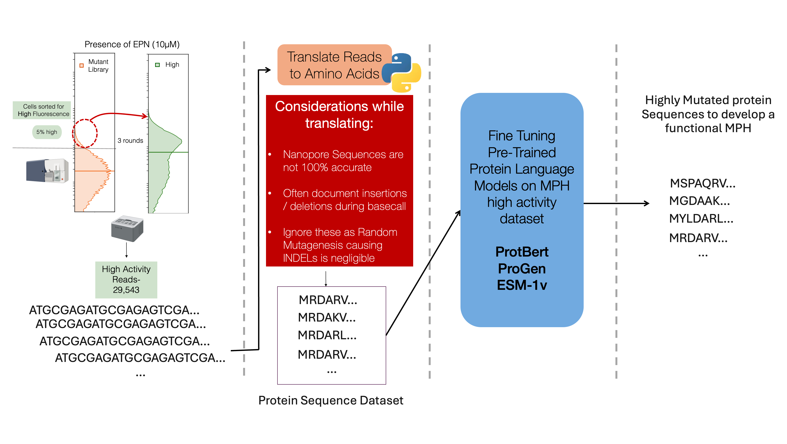

# Biofoundry-based Production and Multiplexed Identification of Mutants

## Introduction

Protein engineering involves the continuous collection and analysis of phenotypic and genotypic data to identify advantageous protein variants. Traditional methods involve either a bottom-up data-driven approach of rational protein design or a top-down high-throughput screening approach of directed evolution to obtain and enhance a specific protein's activity. Rational engineering requires a comprehensive understanding of the protein's structural data, mechanism, and ligand interactions. Directed evolution, on the other hand, focuses on identifying improved candidates through a phenotype-specific selection pressure on a mutant library. This method can be rapidly applied to a wide variety of proteins without necessitating an in-depth understanding of protein mechanisms.

Recent engineering efforts involve the use of structure or sequence based artificial intelligence models trained on general models that narrow the search space to target and the advantageous mutation they provide. These models can be consolidated into a single, cohesive framework to enhance the efficiency of protein engineering and reduce the need for human intervention. By leveraging algorithms to intelligently explore the variant landscape and employing highly adaptable automation robotics for experimental execution, we foresee the development of automated closed-loop protein evolution, or in vitro continuous protein evolution.

Laboratory automation has the potential to significantly enhance throughput, streamline workflows, ensure reproducibility, reduce turnaround time, and generate substantial labor savings. Directed protein evolution (DPE) has yet to fully capitalize on the advancements made in biofoundries. While in vivo continuous evolution approaches present challenges in adapting to diverse proteins and pathways, the development of in vitro continuous protein evolution platforms offers a promising new direction. Despite recent progress in machine learning-driven directed evolution (MLDE), laboratory work remains labor-intensive and requires significant attention from skilled researchers. Moreover, automation offers the potential to explore higher-order variants and global protein landscapes, an area traditionally constrained by experimental limitations. For example, exploring libraries of higher-order variants, such as the diverse AAV (adeno-associated virus) capsid library with 12–29 mutations or the functional GFP library with up to 48 mutations, can benefit significantly from integrated laboratory automation platforms. A fully autonomous system would minimize the need for human supervision, accelerating the construction and analysis of predicted protein variants.

In the context of MLDE, wet-lab experiments typically involve repetitive cycles of molecular biology techniques such as PCR, mutagenesis, library creation, colony picking, plasmid preparation (miniprep), sequencing, and functional assays—many of which are well-suited to full automation. Previous efforts, including PlasmidMaker, automated yeast genome-scale engineering, and BioAutomata, have already automated several of these protocols. Once individual protocols are automated, high-throughput processes can be integrated using robotic arms and scheduling software to create end-to-end pipelines. For example, the researchers behind these initiatives have utilized the Thermo F5 robotic arm, coupled with Thermo Momentum scheduler software, to integrate various core and peripheral equipment. Many commercially available instruments designed for laboratory automation, such as high-throughput liquid handlers from companies like TECAN, Hamilton, Beckman Coulter, and Agilent, can be customized to accommodate smaller instruments like thermocyclers, shakers, and colony pickers. These liquid handlers, including acoustic dispensers like the Echo, can precisely dispense nanoliter quantities and are easily integrated with robotic arms to perform a wide range of assays.

Furthermore, robotics-compatible thermocyclers, fragment analyzers, and sequencers can be incorporated into robotic systems to automate mutagenesis protocols, both site-directed and random. High-throughput plate readers, compatible with laboratory automation, can facilitate automated enzymatic assays. Recent innovations in automated microfluidic devices, with applications in synthetic biology and proteomics, introduce additional possibilities for laboratory automation. Microfluidic devices capable of automating proteomics assays further extend the reach of in vitro continuous protein evolution strategies to a broader array of proteins.

![Automated pipeline to generate and screen through mutants A. An automated pipeline to generate site-directed mutagenesis. Predictions from trained models on an in-silico mutant library of the target protein are used to identify possible candidates. Primers for the candidates are designed depending upon the type of assembly to be done, and ordered. Primers are transferred to a 384 well plate to dispense using Echo. A PCR master mix including KOD, water and template DNA is dispensed to the required wells using Janus/Opentrons2. PCR reaction using a thermocycler is performed after which DNA is purified using AMPure magnetic beads (optional). Once purified, a T4 ligase, T4 PNK, and DpnI mix is dispensed and the reaction is run on the thermocycler. Transformation using the resulting DNA is performed, with the resulting cells grown on an LB + antibiotic plate via spotting overnight in 37oC. Colonies are picked next morning and incubated in a 96-deep well plate to grow cells. B. An automated pipeline to screen through multiple colonies of candidate mutants. A colony PCR plate is prepared using barcoding PCR primers, similar to the plate preparation in A. Phenotyping plates to be performed by Victor/Tecan are prepared from the picked colonies. Colonies undergo a PCR reaction, are pooled and sequenced using Nanopore sequencing. The resulting reads are processed and demultiplexed to provide the final sequence.](images/SDM.png){#fig-sdm}

## Design:

### Random *In-silico* modelling

A *in-silico* library of $1 \times 10^6$ unique variants with each having one to four mutations was generated using a Python script. A single base was substituted randomly across a WT template sequence to develop the mutants. The resulting mutants were encoded in a one-hot encoded manner, and the trained models were used to predict their phenotypes. For each of the mutants, their corresponding primers based on using a site directed mutatagensis method were generated using the primer generator described in Chapter 2.

### Generative AI and Language Models

{#fig-llm}

An alternative method to generate candidates could be to use pre-trained protein language models such as ProtBERT[@brandes2022proteinbert], ProGen[@madani2020progen] or ESM[@rives2019biological; @rao2021msa; @rao2020transformer; @meier2021language; @lin2022language; @hsu2022learning]. These models leverage techniques similar to those used in natural language processing (NLP) but are adapted to the unique structure and functions of proteins. Just as words are composed of letters in natural languages, proteins are made up of sequences of amino acids, the building blocks of proteins. The sequence of amino acids in a protein determines its three-dimensional structure and, ultimately, its function. Each amino acid is represented by a single letter, and the entire protein sequence can be treated similarly to how text is processed in language models. In NLP, language models are trained to predict the next word in a sentence or to understand the meaning of a passage by learning patterns in large corpora of text. In a similar way, protein language models are trained on massive datasets of protein sequences, learning patterns, motifs, and functional relationships between amino acids that allow the model to predict key properties of proteins; the "grammar" of proteins if you will.

To employ these models to predict novel proteins with a desired function, a dataset is used to fine-tune the pre-trained models to look for patterns that follow protein rules, as well as patterns specific to the target protein[@ferruz2022controllable]. The resulting model can provide a sequence, often very different that that of the WT, that is predicted to have the activity as the target protein. These sequences can be constructed using an assembly method described in the next chapter.

In this thesis we attempt to employ the MPH high activity dataset (Chapter 3) to fine tune ProtBERT. To fine-tune the model, the input dataset is of protein sequences with the desired target activity. The first and most complex issue is to translate the output from nanopore. The dataset obtained from nanopore has a read accuracy of 99.6%, suggesting there are on an average of 4 errors per kb. These errors occur due to repetitive base sequences which causes the basecaller algorithm to mistake the sequence to have an insertion or deletion of a base. This can be problematic when translating as it may result in frameshifts that don't actually exist in the actual dataset. As there are negligible amounts of INDELS caused by random mutagenesis by Takara (Tokyo), a script to ignore these mutations and either delete an insertion or add WT base for a deletion at the position is used to translate the sequences. However, there is a caveat as there might be point mutations at the WT base additions which are not accounted for. This problem can be overcome with improved nanopore sequencing or basecalling technology, or the use of PacBio long-read sequencing that has a 99.9% read accuracy.

The fine-tuning using translated sequences is continued with the assumption that they accurately represent the samples. Fine-tuning utilizes large amounts of computational power. The roughly 30,000 reads used 100% of four 25GB memory GPU systems for 163 hours to fine tune the model. This represents as a challenge as it utilizes resources that can be devoted elsewhere. The resulting model was asked to predict MPH sequences with a length of 394aa when the first 20 aa were provided. However, the resulting sequences upon structure prediction did not show much similarity with that of the WT. Although they might still function as MPH, optimization and further modeling is required prior to experimentally validating the same.

## Build: Mutants Generation with Automated Machines

The construction of the mutants is performed by K-Biofoundry *beta* (KRIBB, Daejeon, South Korea) (@fig-sdm A). Mutant primers were designed using a custom python script (Chapter 2: Design Tools) and obtained from Macrogen (Korea). PCR with these primers, KOD One polymerase, and the template DNA was executed to form linear mutated DNA. All primers were dispensed using Echo 525 (Beckman Coulter, IN) to a 96-well PCR plate (BIO-RAD), and other components were dispensed using the Janus G3 Liquid handler (Revvity, MA), with the well-maps constructed using the script described in Chapter 2. This was circularized using T4 Ligase and T4 PNK, and was treated with DpnI (NEB) at 37^o^C for 1 hour, 24^o^C for 2 hours, and deactivated at 65^o^C for 10 min. This was then transformed via heat shock and spotted on a Cell-culture plate (SPL Life Sciences, South Korea) using Janus.

## Test

### Genotyping with Barcoded PCR

To confirm the mutations, 3 colonies for each mutant were picked and grown overnight in 200 $\mu$l cultures in 96-well deep well plates. These were genotyped using an in-house automated pipeline to screen through multiple colonies is described here for the first time (@fig-sdm B).

By using 8 forward and 12 reverse barcoded primers, 96 unique combination of barcoded PCR product could be generated. These primers were generated by a custom script available at <https://mutprimergen.streamlit.app/>. These primers that are accurately dispensed using Echo, were used to perform colony PCR on 2 $\mu$l of aforementioned cultures. All 96-samples were then pooled using Janus and sequenced using GridION as described previously. For genotyping site-directed mutated colonies, sequencing on a flow cell with 500+ pores were run until an estimate of 2k reads per sample were sequenced; for example: 80 samples = 160k reads. This saved cost and effort to screen through hundreds and thousands of colonies for obtaining expected mutants.

A custom algorithm was developed in Python for demultiplexing barcoded PCR products. Although only DNA of a single length is generated after colony PCR and thereby sequenced, the output contains sequences that are much longer possibly owing to the ligase reactions occurring during the sequencing sample library preparation. Reads are trimmed down to the target sequence along with +20 bases length on either ends. The sequences are then sorted into 96 different FASTA files by identifying the forward and reverse barcodes. The sequences are then concatenated using SAMtools.

While constructing single mutants, the entire initial and resulting plasmids were verified using the Rapid Barcoding Kit (SQK-RBK114.24) by ONT, ensuring the construct remained constant throughout. 600ng of each sample were sequenced while following the manufacturer’s instructions. The data processing was the same as described in Chapter 3: Methods: **Sequence Data Processing** with an additional step of making a consensus file using SAMtools.

### Nanopore Analysis

The output of the Nanopore sequencing is the pooled result of the above PCR products, which comprises of different samples with different samples. It is important to demultiplex the samples to differentiate the sequences appropriately.

```         
# Pseudocode for demultiplexing sequences 
Function sort_reads(options):
    # Extract input and output options
    fastafile = options.fastafile
    folder_name = options.output

    # Initialize an empty list to store sequences from the FASTA file
    a = []

    # Parse the FASTA file and store sequences in list 'a'
    For each record in SeqIO.parse(fastafile, "fasta"):
        Add the string of record sequence to list 'a'

    # Define the list of reverse and forward barcodes
    barcodes_R = ["CCCTATGACA", "TAATGGCAAG", "AACAAGGCGT", "GTATGTAGAA", "TTCTATGGGG", "CCTCGCAACC", "TGGATGCTTA", "AGAGTGCGGC"]
    barcodes_F = ["aatcccactac", "tgaactgagcg", "TATCTGACCTT", "ATATGAGACG", "CGCTCATTAG", "TAATCTCGTC", "GCGCGATTTT", "AGAGCACTAG", "TGCCTTGATC", "CTACTCAGTC", "TCGTCTGACT", "GAACATACGG"]

    # Initialize lists to store barcodes and results
    index = []
    act_barcode = []

    # Loop through each sequence in list 'a'
    For i from 0 to length of 'a' - 1:
        Initialize empty list 'barcodes' to store matched barcodes
        Initialize empty list 'bar' to store barcode directions (e.g., "R" or "F")

        # Check for reverse barcode matches
        For each barcode in barcodes_R:
            Reverse complement the barcode
            If the original or reverse complement of the barcode is found in 'a[i]':
                Append the barcode index (1-based) to 'barcodes'
                Append "R" to the list 'bar' (indicating reverse barcode)

        # Check for forward barcode matches
        For each barcode in barcodes_F:
            Reverse complement the barcode
            If the original or reverse complement of the barcode (uppercased) is found in 'a[i]':
                Append the barcode index (1-based) to 'barcodes'
                Append "F" to the list 'bar' (indicating forward barcode)

        # Join the 'bar' list into a string (e.g., "R_F")
        Join all elements of 'bar' with underscore ("_") and store in 'bar'

        # If both reverse and forward barcodes are found (i.e., "R_F")
        If 'bar' is equal to "R_F" and the length of 'barcodes' is exactly 2:
            Construct the active barcode string as "barcodes[0]_" + "barcodes[1]"
            
            # Open a file for writing sequences with the active barcode name
            Open a file with the name format '{folder_name}/{active barcode}.fasta' in append mode:
                Write the header line with the barcode information (">bar")
                Write the sequence 'a[i]'

End Function
    
```

### Phenotyping using a Plate Reader

The triplicates of individual samples were analyzed using Victor (Perkin Elmer; Waltham, MA, USA) using 96-well plates (Sigma Aldrich; St. Louis, MO, USA). Following the identification of a correctly constructed mutant, 1% of each mutant sample was inoculated in 200ml of LB using Janus and grown at 37^o^C for 16hrs in a shaking incubator. Relative Fluorescence was calculated using fluorescence over optical density at 595nm.

## Learn: Structure Predictions

A locally installed AlphaFold (v.2.3.2) was run on DmpR~WT~, MPH~WT~ and variants was run to obtain structures of the partially/non-identified proteins. Both were constructed as monomers.

Using the positional information, the role and importance of the residue can be interpreted. For example, P482Q is present at a linker between the ATPase domain of DmpR and the DNA binding domain (@fig-AF_dmpr_P482Q). Substituting proline for glutamine may promote water-based H-bonding which improves flexible binding and release of the TF from the promoter DNA.

![A. Domain positions of DmpR across the protein sequence, adapted from Park, Kwang-Hyun, et al, 2020. In blue is the sensory domain or substrate binding domain, in green is the B-linker which links the substrate binding domain and the ATPase domain in pink. The gray regions are peptide sequences which were deleted to resolve the protein structure. The C-terminal is the DNA-binding domain for the transcription factor.B. An AlphaFold predicted structure (visualized in PyMol) of a DmpR monomer color coded to A, to incorporate the DNA-binding domain. The residue at the 482nd residue is highlighted. Proline is the WT amino acid and on substituting it for Glutamine there is an improved response to phenol. Proline is known to contribute to conformational rigidity, and when replacing it with Glutamine allows for a flexible linker between the two domains. Additionally, the polarity of glutamine may contribute to H-bonding with other amino acids or water molecules in the environment, providing stability in the structure.C. (Left)FACS analysis comparisons of P482Q (green) and WT (blue). (Right) FACS analysis comparisons of the Signal (green) and Background (gray) of P482Q.](images/p482q.png){#fig-AF_dmpr_P482Q}

## Impact

This method was considerably faster than manually mutating, allowing upto 96 simultaneous 3-mutation mutants to be created by iterating the SDM process. Each round of SDM took about 3 working days from construction to verification. Additionally, by multiplexed barcode-PCR sequencing, the cost of per sample was reduced considerably when compared to that of Sanger Sequencing performed by sequencing companies. Lastly, as the number of Nanopore sequences are 96, and if using 384-well plates, theoretically, upto 36,864 samples could be sequenced simultaneously. The multiplexed sequencing can be used not only during protein engineering, but verifying sequences for regulatory elements, or whole genetic circuits.